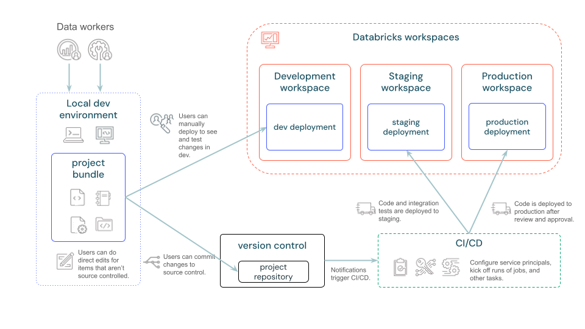
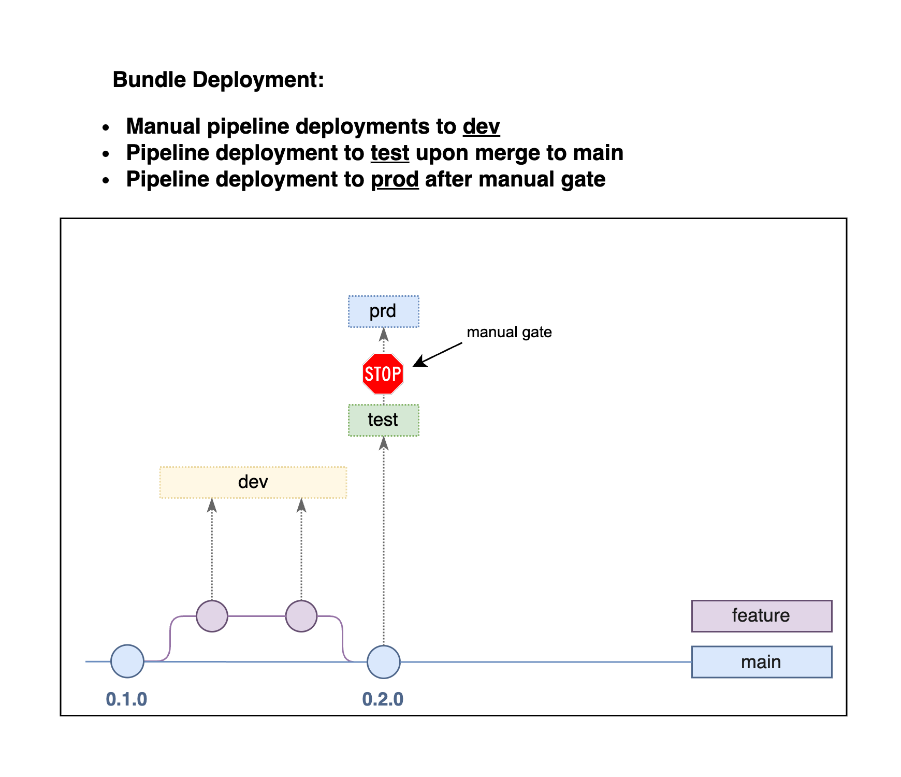

# Deployment

[Declarative Automation Bundles](https://docs.databricks.com/aws/en/dev-tools/bundles/) enable software engineering best practices for data and AI projects through source control, code review, testing, and CI/CD.
Bundles define your entire project—structure, tests, and deployment—as source files, making collaboration seamless.

A bundle contains:

- Cloud infrastructure and workspace configurations
- Business logic (notebooks, Python files)
- Resource definitions (jobs, pipelines, Model Serving endpoints, MLflow experiments)
- Unit and integration tests

The following diagram provides a high-level view of a development and CI/CD pipeline with bundles:



## Git Strategy

**GitHub Flow**: `main` is the integration branch and is always buildable;
work happens on short-lived feature branches that are merged back through a
pull request. There are no release branches -- this project deploys from
`main`, and a fix is just another branch and PR.

| Branch | Purpose | Lifecycle |
|--------|---------|-----------|
| **main** | Integration branch, always buildable | Permanent |
| **feature** | Feature development and bug fixes | Short-lived (days) |

Commit messages follow [Conventional Commits](https://www.conventionalcommits.org),
enforced locally by the `commitizen` pre-commit hook.

## Bundle Targets

`databricks.yml` defines three targets:

- **`dev`** (default, `mode: development`) -- resources are prefixed with
  `[dev <user>]` and deployed under the deploying user's workspace folder,
  so two people never collide. This is the only target CI deploys to.
- **`test`** and **`prod`** (`mode: production`) -- defined and validated,
  but not wired to an automated deployment in this repository.

Deploy manually with:

```bash
databricks bundle validate --target dev
databricks bundle deploy --target dev
databricks bundle run property_revenue --target dev
```



## CI/CD

One GitHub Actions workflow, `.github/workflows/pr-deploy-dev.yml`, runs on
every pull request targeting `main` (and on demand via `workflow_dispatch`).

**`validate`** -- installs the locked environment with `uv sync --frozen`,
then runs `ruff check`, `ruff format --check`, `ty` and `pydoclint`; builds
the wheel and diffs the unpacked sdist against `src/` to catch a source file
that would silently not ship; then runs `pytest` with coverage.

**`deploy-dev`** -- gated on `validate`, so a failing check or test blocks
the deployment. Runs `databricks bundle validate` and `databricks bundle
deploy` against the `dev` target, then writes `bundle summary` into the run
summary. Deploys are serialised across pull requests by a job-level
concurrency group, since every PR targets the same `dev` deployment.

Both jobs authenticate with the `DATABRICKS_HOST` and `DATABRICKS_TOKEN`
repository secrets. The tests need them as much as the deploy does:
`tests/conftest.py` opens a real serverless Databricks Connect session
rather than a local Spark one, so without credentials the twelve
session-backed tests fail while the rest pass.

Note that the workflow deploys the bundle but does not *run* the pipeline --
a pipeline update is still triggered manually, which is also the only thing
that executes the notebook code.
